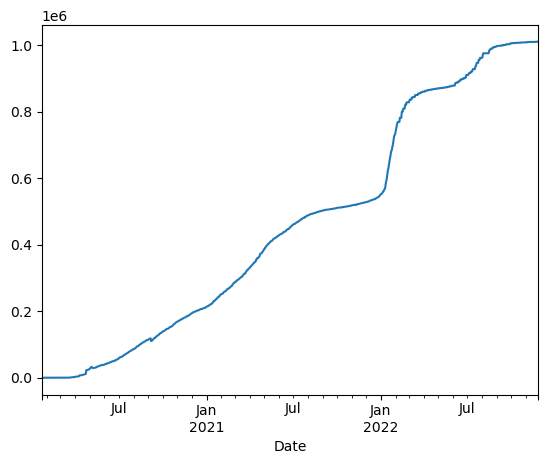
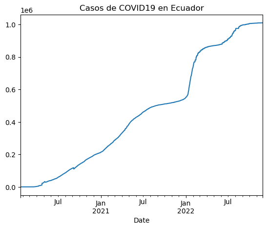
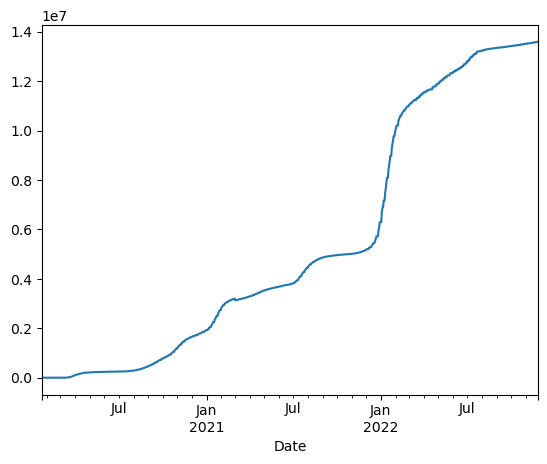
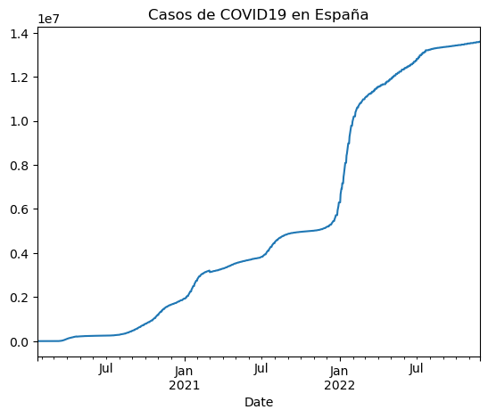
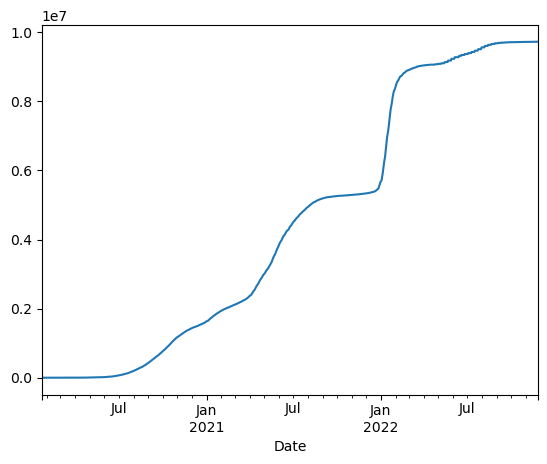
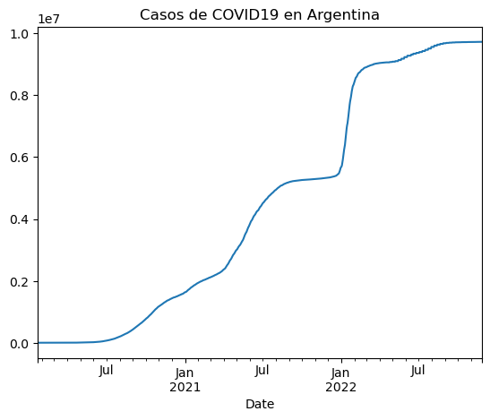

## Luisa Fernanda Restrepo Perdomo

## Uso de la api COVID19 con pandas
En esta práctica y la ad4 vamos a utilizar "pandas" una libreria para trabajar sobre los datos de covid19 y analizarlos desde la 
una api con información cuya URL es: https://covid19api.com/

## Instalación de la librería
Para instalar la librería "pandas" usaremos la función "pip". La exclamación es necesaria para que se ejecute.


```python
!pip install pandas

```

    Requirement already satisfied: pandas in c:\users\luisa\anaconda3\lib\site-packages (1.4.4)
    Requirement already satisfied: python-dateutil>=2.8.1 in c:\users\luisa\anaconda3\lib\site-packages (from pandas) (2.8.2)
    Requirement already satisfied: numpy>=1.18.5 in c:\users\luisa\anaconda3\lib\site-packages (from pandas) (1.21.5)
    Requirement already satisfied: pytz>=2020.1 in c:\users\luisa\anaconda3\lib\site-packages (from pandas) (2022.1)
    Requirement already satisfied: six>=1.5 in c:\users\luisa\anaconda3\lib\site-packages (from python-dateutil>=2.8.1->pandas) (1.16.0)
    

## Configuración de pandas
Para importar utilizaremos la convención "pd" como abreviatura para llamar a la librería.


```python
import pandas as pd
```

## Crear variables 
Las variables se asignan con el signo "=" y los escribimos entrecomillados por ser una cadena de carácteres.


```python
miurl = "https://api.covid19api.com/countries"
```


```python
miurl
```


    'https://api.covid19api.com/countries'


```python
type(miurl)
```


    str


## Empieza la magia de pandas
### Creamos un dataframe
La abreviatura que se emplea para dataframe es "df". Existe una función "read_json()" que lee el formato "json" (java script). Dentro del parentesis ponemos el formato de lo que queremos que lea el dataframe, que en este caso es nuestra url.


```python
df = pd.read_json(miurl)
```

Para visualizar los datos llamamos al objeto. La información se nos muestra en una tabla que contiene 3 columnas y una fila de control de pandas que indica las entradas del dataframe.


```python
df
```


<div>
<style scoped>
    .dataframe tbody tr th:only-of-type {
        vertical-align: middle;
    }

    .dataframe tbody tr th {
        vertical-align: top;
    }

    .dataframe thead th {
        text-align: right;
    }
</style>
<table border="1" class="dataframe">
  <thead>
    <tr style="text-align: right;">
      <th></th>
      <th>Country</th>
      <th>Slug</th>
      <th>ISO2</th>
    </tr>
  </thead>
  <tbody>
    <tr>
      <th>0</th>
      <td>Angola</td>
      <td>angola</td>
      <td>AO</td>
    </tr>
    <tr>
      <th>1</th>
      <td>Georgia</td>
      <td>georgia</td>
      <td>GE</td>
    </tr>
    <tr>
      <th>2</th>
      <td>Ireland</td>
      <td>ireland</td>
      <td>IE</td>
    </tr>
    <tr>
      <th>3</th>
      <td>Slovenia</td>
      <td>slovenia</td>
      <td>SI</td>
    </tr>
    <tr>
      <th>4</th>
      <td>French Guiana</td>
      <td>french-guiana</td>
      <td>GF</td>
    </tr>
    <tr>
      <th>...</th>
      <td>...</td>
      <td>...</td>
      <td>...</td>
    </tr>
    <tr>
      <th>243</th>
      <td>Sri Lanka</td>
      <td>sri-lanka</td>
      <td>LK</td>
    </tr>
    <tr>
      <th>244</th>
      <td>Canada</td>
      <td>canada</td>
      <td>CA</td>
    </tr>
    <tr>
      <th>245</th>
      <td>Kuwait</td>
      <td>kuwait</td>
      <td>KW</td>
    </tr>
    <tr>
      <th>246</th>
      <td>Libya</td>
      <td>libya</td>
      <td>LY</td>
    </tr>
    <tr>
      <th>247</th>
      <td>Seychelles</td>
      <td>seychelles</td>
      <td>SC</td>
    </tr>
  </tbody>
</table>
<p>248 rows × 3 columns</p>
</div>


## Exploración de la tabla
Para ver las entradas de la tabla (el número que se le ponga es la cantidad de datos que quieres visualizar tanto de los primeros datos como los últimos) utilizamos la función head o tail:


```python
df.head (12)
```


<div>
<style scoped>
    .dataframe tbody tr th:only-of-type {
        vertical-align: middle;
    }

    .dataframe tbody tr th {
        vertical-align: top;
    }

    .dataframe thead th {
        text-align: right;
    }
</style>
<table border="1" class="dataframe">
  <thead>
    <tr style="text-align: right;">
      <th></th>
      <th>Country</th>
      <th>Slug</th>
      <th>ISO2</th>
    </tr>
  </thead>
  <tbody>
    <tr>
      <th>0</th>
      <td>Angola</td>
      <td>angola</td>
      <td>AO</td>
    </tr>
    <tr>
      <th>1</th>
      <td>Georgia</td>
      <td>georgia</td>
      <td>GE</td>
    </tr>
    <tr>
      <th>2</th>
      <td>Ireland</td>
      <td>ireland</td>
      <td>IE</td>
    </tr>
    <tr>
      <th>3</th>
      <td>Slovenia</td>
      <td>slovenia</td>
      <td>SI</td>
    </tr>
    <tr>
      <th>4</th>
      <td>French Guiana</td>
      <td>french-guiana</td>
      <td>GF</td>
    </tr>
    <tr>
      <th>5</th>
      <td>Guam</td>
      <td>guam</td>
      <td>GU</td>
    </tr>
    <tr>
      <th>6</th>
      <td>Lebanon</td>
      <td>lebanon</td>
      <td>LB</td>
    </tr>
    <tr>
      <th>7</th>
      <td>Puerto Rico</td>
      <td>puerto-rico</td>
      <td>PR</td>
    </tr>
    <tr>
      <th>8</th>
      <td>Togo</td>
      <td>togo</td>
      <td>TG</td>
    </tr>
    <tr>
      <th>9</th>
      <td>American Samoa</td>
      <td>american-samoa</td>
      <td>AS</td>
    </tr>
    <tr>
      <th>10</th>
      <td>Guinea-Bissau</td>
      <td>guinea-bissau</td>
      <td>GW</td>
    </tr>
    <tr>
      <th>11</th>
      <td>Isle of Man</td>
      <td>isle-of-man</td>
      <td>IM</td>
    </tr>
  </tbody>
</table>
</div>


```python
df.tail (8)
```


<div>
<style scoped>
    .dataframe tbody tr th:only-of-type {
        vertical-align: middle;
    }

    .dataframe tbody tr th {
        vertical-align: top;
    }

    .dataframe thead th {
        text-align: right;
    }
</style>
<table border="1" class="dataframe">
  <thead>
    <tr style="text-align: right;">
      <th></th>
      <th>Country</th>
      <th>Slug</th>
      <th>ISO2</th>
    </tr>
  </thead>
  <tbody>
    <tr>
      <th>240</th>
      <td>Russian Federation</td>
      <td>russia</td>
      <td>RU</td>
    </tr>
    <tr>
      <th>241</th>
      <td>Chile</td>
      <td>chile</td>
      <td>CL</td>
    </tr>
    <tr>
      <th>242</th>
      <td>Spain</td>
      <td>spain</td>
      <td>ES</td>
    </tr>
    <tr>
      <th>243</th>
      <td>Sri Lanka</td>
      <td>sri-lanka</td>
      <td>LK</td>
    </tr>
    <tr>
      <th>244</th>
      <td>Canada</td>
      <td>canada</td>
      <td>CA</td>
    </tr>
    <tr>
      <th>245</th>
      <td>Kuwait</td>
      <td>kuwait</td>
      <td>KW</td>
    </tr>
    <tr>
      <th>246</th>
      <td>Libya</td>
      <td>libya</td>
      <td>LY</td>
    </tr>
    <tr>
      <th>247</th>
      <td>Seychelles</td>
      <td>seychelles</td>
      <td>SC</td>
    </tr>
  </tbody>
</table>
</div>


Para ver la información sobre las variables que contiene el dataframe se usa la siguiente función:


```python
df.info()
```

    <class 'pandas.core.frame.DataFrame'>
    RangeIndex: 248 entries, 0 to 247
    Data columns (total 3 columns):
     #   Column   Non-Null Count  Dtype 
    ---  ------   --------------  ----- 
     0   Country  248 non-null    object
     1   Slug     248 non-null    object
     2   ISO2     248 non-null    object
    dtypes: object(3)
    memory usage: 5.9+ KB
    

Para visualizar una sola de las variables se pone df y el nombre de la variable que quieras visualizar:


```python
df["Slug"]
```


    0             angola
    1            georgia
    2            ireland
    3           slovenia
    4      french-guiana
               ...      
    243        sri-lanka
    244           canada
    245           kuwait
    246            libya
    247       seychelles
    Name: Slug, Length: 248, dtype: object


## Tiempo real
La url que utilizaremos es  https://covid19api.com/countrt/colombia/status/confirmed/live
Guardaremos los datos como hicimos anteriormente. Pondremos "df_es" para identificar el país, el ejemplo es el de España pero varia de acuerdo al país del que requiramos información. En este caso haremos la tabla de Ecuador, la de España y la de Argentina. 


```python
url_ec = 'https://api.covid19api.com/country/ecuador/status/confirmed/live'
df_ec = pd.read_json(url_ec)
df_ec
```


<div>
<style scoped>
    .dataframe tbody tr th:only-of-type {
        vertical-align: middle;
    }

    .dataframe tbody tr th {
        vertical-align: top;
    }

    .dataframe thead th {
        text-align: right;
    }
</style>
<table border="1" class="dataframe">
  <thead>
    <tr style="text-align: right;">
      <th></th>
      <th>Country</th>
      <th>CountryCode</th>
      <th>Province</th>
      <th>City</th>
      <th>CityCode</th>
      <th>Lat</th>
      <th>Lon</th>
      <th>Cases</th>
      <th>Status</th>
      <th>Date</th>
    </tr>
  </thead>
  <tbody>
    <tr>
      <th>0</th>
      <td>Ecuador</td>
      <td>EC</td>
      <td></td>
      <td></td>
      <td></td>
      <td>-1.83</td>
      <td>-78.18</td>
      <td>0</td>
      <td>confirmed</td>
      <td>2020-01-22 00:00:00+00:00</td>
    </tr>
    <tr>
      <th>1</th>
      <td>Ecuador</td>
      <td>EC</td>
      <td></td>
      <td></td>
      <td></td>
      <td>-1.83</td>
      <td>-78.18</td>
      <td>0</td>
      <td>confirmed</td>
      <td>2020-01-23 00:00:00+00:00</td>
    </tr>
    <tr>
      <th>2</th>
      <td>Ecuador</td>
      <td>EC</td>
      <td></td>
      <td></td>
      <td></td>
      <td>-1.83</td>
      <td>-78.18</td>
      <td>0</td>
      <td>confirmed</td>
      <td>2020-01-24 00:00:00+00:00</td>
    </tr>
    <tr>
      <th>3</th>
      <td>Ecuador</td>
      <td>EC</td>
      <td></td>
      <td></td>
      <td></td>
      <td>-1.83</td>
      <td>-78.18</td>
      <td>0</td>
      <td>confirmed</td>
      <td>2020-01-25 00:00:00+00:00</td>
    </tr>
    <tr>
      <th>4</th>
      <td>Ecuador</td>
      <td>EC</td>
      <td></td>
      <td></td>
      <td></td>
      <td>-1.83</td>
      <td>-78.18</td>
      <td>0</td>
      <td>confirmed</td>
      <td>2020-01-26 00:00:00+00:00</td>
    </tr>
    <tr>
      <th>...</th>
      <td>...</td>
      <td>...</td>
      <td>...</td>
      <td>...</td>
      <td>...</td>
      <td>...</td>
      <td>...</td>
      <td>...</td>
      <td>...</td>
      <td>...</td>
    </tr>
    <tr>
      <th>1035</th>
      <td>Ecuador</td>
      <td>EC</td>
      <td></td>
      <td></td>
      <td></td>
      <td>-1.83</td>
      <td>-78.18</td>
      <td>1009958</td>
      <td>confirmed</td>
      <td>2022-11-22 00:00:00+00:00</td>
    </tr>
    <tr>
      <th>1036</th>
      <td>Ecuador</td>
      <td>EC</td>
      <td></td>
      <td></td>
      <td></td>
      <td>-1.83</td>
      <td>-78.18</td>
      <td>1009958</td>
      <td>confirmed</td>
      <td>2022-11-23 00:00:00+00:00</td>
    </tr>
    <tr>
      <th>1037</th>
      <td>Ecuador</td>
      <td>EC</td>
      <td></td>
      <td></td>
      <td></td>
      <td>-1.83</td>
      <td>-78.18</td>
      <td>1009958</td>
      <td>confirmed</td>
      <td>2022-11-24 00:00:00+00:00</td>
    </tr>
    <tr>
      <th>1038</th>
      <td>Ecuador</td>
      <td>EC</td>
      <td></td>
      <td></td>
      <td></td>
      <td>-1.83</td>
      <td>-78.18</td>
      <td>1009958</td>
      <td>confirmed</td>
      <td>2022-11-25 00:00:00+00:00</td>
    </tr>
    <tr>
      <th>1039</th>
      <td>Ecuador</td>
      <td>EC</td>
      <td></td>
      <td></td>
      <td></td>
      <td>-1.83</td>
      <td>-78.18</td>
      <td>1009958</td>
      <td>confirmed</td>
      <td>2022-11-26 00:00:00+00:00</td>
    </tr>
  </tbody>
</table>
<p>1040 rows × 10 columns</p>
</div>


## Elaboración de un gráfico
Para la elaboración del gráfico, el eje X será la fecha, y el eje Y los casos confirmados.
Establecemos la fecha como la columna de control de este dataframe.


```python
df_ec.set_index('Date')
```


<div>
<style scoped>
    .dataframe tbody tr th:only-of-type {
        vertical-align: middle;
    }

    .dataframe tbody tr th {
        vertical-align: top;
    }

    .dataframe thead th {
        text-align: right;
    }
</style>
<table border="1" class="dataframe">
  <thead>
    <tr style="text-align: right;">
      <th></th>
      <th>Country</th>
      <th>CountryCode</th>
      <th>Province</th>
      <th>City</th>
      <th>CityCode</th>
      <th>Lat</th>
      <th>Lon</th>
      <th>Cases</th>
      <th>Status</th>
    </tr>
    <tr>
      <th>Date</th>
      <th></th>
      <th></th>
      <th></th>
      <th></th>
      <th></th>
      <th></th>
      <th></th>
      <th></th>
      <th></th>
    </tr>
  </thead>
  <tbody>
    <tr>
      <th>2020-01-22 00:00:00+00:00</th>
      <td>Ecuador</td>
      <td>EC</td>
      <td></td>
      <td></td>
      <td></td>
      <td>-1.83</td>
      <td>-78.18</td>
      <td>0</td>
      <td>confirmed</td>
    </tr>
    <tr>
      <th>2020-01-23 00:00:00+00:00</th>
      <td>Ecuador</td>
      <td>EC</td>
      <td></td>
      <td></td>
      <td></td>
      <td>-1.83</td>
      <td>-78.18</td>
      <td>0</td>
      <td>confirmed</td>
    </tr>
    <tr>
      <th>2020-01-24 00:00:00+00:00</th>
      <td>Ecuador</td>
      <td>EC</td>
      <td></td>
      <td></td>
      <td></td>
      <td>-1.83</td>
      <td>-78.18</td>
      <td>0</td>
      <td>confirmed</td>
    </tr>
    <tr>
      <th>2020-01-25 00:00:00+00:00</th>
      <td>Ecuador</td>
      <td>EC</td>
      <td></td>
      <td></td>
      <td></td>
      <td>-1.83</td>
      <td>-78.18</td>
      <td>0</td>
      <td>confirmed</td>
    </tr>
    <tr>
      <th>2020-01-26 00:00:00+00:00</th>
      <td>Ecuador</td>
      <td>EC</td>
      <td></td>
      <td></td>
      <td></td>
      <td>-1.83</td>
      <td>-78.18</td>
      <td>0</td>
      <td>confirmed</td>
    </tr>
    <tr>
      <th>...</th>
      <td>...</td>
      <td>...</td>
      <td>...</td>
      <td>...</td>
      <td>...</td>
      <td>...</td>
      <td>...</td>
      <td>...</td>
      <td>...</td>
    </tr>
    <tr>
      <th>2022-11-22 00:00:00+00:00</th>
      <td>Ecuador</td>
      <td>EC</td>
      <td></td>
      <td></td>
      <td></td>
      <td>-1.83</td>
      <td>-78.18</td>
      <td>1009958</td>
      <td>confirmed</td>
    </tr>
    <tr>
      <th>2022-11-23 00:00:00+00:00</th>
      <td>Ecuador</td>
      <td>EC</td>
      <td></td>
      <td></td>
      <td></td>
      <td>-1.83</td>
      <td>-78.18</td>
      <td>1009958</td>
      <td>confirmed</td>
    </tr>
    <tr>
      <th>2022-11-24 00:00:00+00:00</th>
      <td>Ecuador</td>
      <td>EC</td>
      <td></td>
      <td></td>
      <td></td>
      <td>-1.83</td>
      <td>-78.18</td>
      <td>1009958</td>
      <td>confirmed</td>
    </tr>
    <tr>
      <th>2022-11-25 00:00:00+00:00</th>
      <td>Ecuador</td>
      <td>EC</td>
      <td></td>
      <td></td>
      <td></td>
      <td>-1.83</td>
      <td>-78.18</td>
      <td>1009958</td>
      <td>confirmed</td>
    </tr>
    <tr>
      <th>2022-11-26 00:00:00+00:00</th>
      <td>Ecuador</td>
      <td>EC</td>
      <td></td>
      <td></td>
      <td></td>
      <td>-1.83</td>
      <td>-78.18</td>
      <td>1009958</td>
      <td>confirmed</td>
    </tr>
  </tbody>
</table>
<p>1040 rows × 9 columns</p>
</div>


Le añado también los casos confirmados, con la siguiente fórmula:


```python
df_ec.set_index ('Date')['Cases']
```


    Date
    2020-01-22 00:00:00+00:00          0
    2020-01-23 00:00:00+00:00          0
    2020-01-24 00:00:00+00:00          0
    2020-01-25 00:00:00+00:00          0
    2020-01-26 00:00:00+00:00          0
                                  ...   
    2022-11-22 00:00:00+00:00    1009958
    2022-11-23 00:00:00+00:00    1009958
    2022-11-24 00:00:00+00:00    1009958
    2022-11-25 00:00:00+00:00    1009958
    2022-11-26 00:00:00+00:00    1009958
    Name: Cases, Length: 1040, dtype: int64


Con estos datos creamos el gráfico con la función "plot", que significa que haga un gráfico.


```python
df_ec.set_index('Date')['Cases'].plot()
```


    <AxesSubplot:xlabel='Date'>


    

    


Nombramos el gráfico con el atributo title para que quede completo.


```python
df_ec.set_index('Date')['Cases'].plot(title="Casos de COVID19 en Ecuador")
```


    <AxesSubplot:title={'center':'Casos de COVID19 en Ecuador'}, xlabel='Date'>


    

    


Ahora propondremos el siguiente País, España:


```python
url_es = 'https://api.covid19api.com/country/spain/status/confirmed/live'
df_es = pd.read_json(url_es)
df_es
```


<div>
<style scoped>
    .dataframe tbody tr th:only-of-type {
        vertical-align: middle;
    }

    .dataframe tbody tr th {
        vertical-align: top;
    }

    .dataframe thead th {
        text-align: right;
    }
</style>
<table border="1" class="dataframe">
  <thead>
    <tr style="text-align: right;">
      <th></th>
      <th>Country</th>
      <th>CountryCode</th>
      <th>Province</th>
      <th>City</th>
      <th>CityCode</th>
      <th>Lat</th>
      <th>Lon</th>
      <th>Cases</th>
      <th>Status</th>
      <th>Date</th>
    </tr>
  </thead>
  <tbody>
    <tr>
      <th>0</th>
      <td>Spain</td>
      <td>ES</td>
      <td></td>
      <td></td>
      <td></td>
      <td>40.46</td>
      <td>-3.75</td>
      <td>0</td>
      <td>confirmed</td>
      <td>2020-01-22 00:00:00+00:00</td>
    </tr>
    <tr>
      <th>1</th>
      <td>Spain</td>
      <td>ES</td>
      <td></td>
      <td></td>
      <td></td>
      <td>40.46</td>
      <td>-3.75</td>
      <td>0</td>
      <td>confirmed</td>
      <td>2020-01-23 00:00:00+00:00</td>
    </tr>
    <tr>
      <th>2</th>
      <td>Spain</td>
      <td>ES</td>
      <td></td>
      <td></td>
      <td></td>
      <td>40.46</td>
      <td>-3.75</td>
      <td>0</td>
      <td>confirmed</td>
      <td>2020-01-24 00:00:00+00:00</td>
    </tr>
    <tr>
      <th>3</th>
      <td>Spain</td>
      <td>ES</td>
      <td></td>
      <td></td>
      <td></td>
      <td>40.46</td>
      <td>-3.75</td>
      <td>0</td>
      <td>confirmed</td>
      <td>2020-01-25 00:00:00+00:00</td>
    </tr>
    <tr>
      <th>4</th>
      <td>Spain</td>
      <td>ES</td>
      <td></td>
      <td></td>
      <td></td>
      <td>40.46</td>
      <td>-3.75</td>
      <td>0</td>
      <td>confirmed</td>
      <td>2020-01-26 00:00:00+00:00</td>
    </tr>
    <tr>
      <th>...</th>
      <td>...</td>
      <td>...</td>
      <td>...</td>
      <td>...</td>
      <td>...</td>
      <td>...</td>
      <td>...</td>
      <td>...</td>
      <td>...</td>
      <td>...</td>
    </tr>
    <tr>
      <th>1035</th>
      <td>Spain</td>
      <td>ES</td>
      <td></td>
      <td></td>
      <td></td>
      <td>40.46</td>
      <td>-3.75</td>
      <td>13573721</td>
      <td>confirmed</td>
      <td>2022-11-22 00:00:00+00:00</td>
    </tr>
    <tr>
      <th>1036</th>
      <td>Spain</td>
      <td>ES</td>
      <td></td>
      <td></td>
      <td></td>
      <td>40.46</td>
      <td>-3.75</td>
      <td>13573721</td>
      <td>confirmed</td>
      <td>2022-11-23 00:00:00+00:00</td>
    </tr>
    <tr>
      <th>1037</th>
      <td>Spain</td>
      <td>ES</td>
      <td></td>
      <td></td>
      <td></td>
      <td>40.46</td>
      <td>-3.75</td>
      <td>13573721</td>
      <td>confirmed</td>
      <td>2022-11-24 00:00:00+00:00</td>
    </tr>
    <tr>
      <th>1038</th>
      <td>Spain</td>
      <td>ES</td>
      <td></td>
      <td></td>
      <td></td>
      <td>40.46</td>
      <td>-3.75</td>
      <td>13595504</td>
      <td>confirmed</td>
      <td>2022-11-25 00:00:00+00:00</td>
    </tr>
    <tr>
      <th>1039</th>
      <td>Spain</td>
      <td>ES</td>
      <td></td>
      <td></td>
      <td></td>
      <td>40.46</td>
      <td>-3.75</td>
      <td>13595504</td>
      <td>confirmed</td>
      <td>2022-11-26 00:00:00+00:00</td>
    </tr>
  </tbody>
</table>
<p>1040 rows × 10 columns</p>
</div>


```python
df_es.set_index('Date')
```


<div>
<style scoped>
    .dataframe tbody tr th:only-of-type {
        vertical-align: middle;
    }

    .dataframe tbody tr th {
        vertical-align: top;
    }

    .dataframe thead th {
        text-align: right;
    }
</style>
<table border="1" class="dataframe">
  <thead>
    <tr style="text-align: right;">
      <th></th>
      <th>Country</th>
      <th>CountryCode</th>
      <th>Province</th>
      <th>City</th>
      <th>CityCode</th>
      <th>Lat</th>
      <th>Lon</th>
      <th>Cases</th>
      <th>Status</th>
    </tr>
    <tr>
      <th>Date</th>
      <th></th>
      <th></th>
      <th></th>
      <th></th>
      <th></th>
      <th></th>
      <th></th>
      <th></th>
      <th></th>
    </tr>
  </thead>
  <tbody>
    <tr>
      <th>2020-01-22 00:00:00+00:00</th>
      <td>Spain</td>
      <td>ES</td>
      <td></td>
      <td></td>
      <td></td>
      <td>40.46</td>
      <td>-3.75</td>
      <td>0</td>
      <td>confirmed</td>
    </tr>
    <tr>
      <th>2020-01-23 00:00:00+00:00</th>
      <td>Spain</td>
      <td>ES</td>
      <td></td>
      <td></td>
      <td></td>
      <td>40.46</td>
      <td>-3.75</td>
      <td>0</td>
      <td>confirmed</td>
    </tr>
    <tr>
      <th>2020-01-24 00:00:00+00:00</th>
      <td>Spain</td>
      <td>ES</td>
      <td></td>
      <td></td>
      <td></td>
      <td>40.46</td>
      <td>-3.75</td>
      <td>0</td>
      <td>confirmed</td>
    </tr>
    <tr>
      <th>2020-01-25 00:00:00+00:00</th>
      <td>Spain</td>
      <td>ES</td>
      <td></td>
      <td></td>
      <td></td>
      <td>40.46</td>
      <td>-3.75</td>
      <td>0</td>
      <td>confirmed</td>
    </tr>
    <tr>
      <th>2020-01-26 00:00:00+00:00</th>
      <td>Spain</td>
      <td>ES</td>
      <td></td>
      <td></td>
      <td></td>
      <td>40.46</td>
      <td>-3.75</td>
      <td>0</td>
      <td>confirmed</td>
    </tr>
    <tr>
      <th>...</th>
      <td>...</td>
      <td>...</td>
      <td>...</td>
      <td>...</td>
      <td>...</td>
      <td>...</td>
      <td>...</td>
      <td>...</td>
      <td>...</td>
    </tr>
    <tr>
      <th>2022-11-22 00:00:00+00:00</th>
      <td>Spain</td>
      <td>ES</td>
      <td></td>
      <td></td>
      <td></td>
      <td>40.46</td>
      <td>-3.75</td>
      <td>13573721</td>
      <td>confirmed</td>
    </tr>
    <tr>
      <th>2022-11-23 00:00:00+00:00</th>
      <td>Spain</td>
      <td>ES</td>
      <td></td>
      <td></td>
      <td></td>
      <td>40.46</td>
      <td>-3.75</td>
      <td>13573721</td>
      <td>confirmed</td>
    </tr>
    <tr>
      <th>2022-11-24 00:00:00+00:00</th>
      <td>Spain</td>
      <td>ES</td>
      <td></td>
      <td></td>
      <td></td>
      <td>40.46</td>
      <td>-3.75</td>
      <td>13573721</td>
      <td>confirmed</td>
    </tr>
    <tr>
      <th>2022-11-25 00:00:00+00:00</th>
      <td>Spain</td>
      <td>ES</td>
      <td></td>
      <td></td>
      <td></td>
      <td>40.46</td>
      <td>-3.75</td>
      <td>13595504</td>
      <td>confirmed</td>
    </tr>
    <tr>
      <th>2022-11-26 00:00:00+00:00</th>
      <td>Spain</td>
      <td>ES</td>
      <td></td>
      <td></td>
      <td></td>
      <td>40.46</td>
      <td>-3.75</td>
      <td>13595504</td>
      <td>confirmed</td>
    </tr>
  </tbody>
</table>
<p>1040 rows × 9 columns</p>
</div>


```python
df_es.set_index ('Date')['Cases']
```


    Date
    2020-01-22 00:00:00+00:00           0
    2020-01-23 00:00:00+00:00           0
    2020-01-24 00:00:00+00:00           0
    2020-01-25 00:00:00+00:00           0
    2020-01-26 00:00:00+00:00           0
                                   ...   
    2022-11-22 00:00:00+00:00    13573721
    2022-11-23 00:00:00+00:00    13573721
    2022-11-24 00:00:00+00:00    13573721
    2022-11-25 00:00:00+00:00    13595504
    2022-11-26 00:00:00+00:00    13595504
    Name: Cases, Length: 1040, dtype: int64


```python
df_es.set_index('Date')['Cases'].plot()
```


    <AxesSubplot:xlabel='Date'>


    

    


```python
df_es.set_index('Date')['Cases'].plot(title="Casos de COVID19 en España")
```


    <AxesSubplot:title={'center':'Casos de COVID19 en España'}, xlabel='Date'>


    

    


Ahora continuaremos con Argentina:


```python
url_ar = 'https://api.covid19api.com/country/argentina/status/confirmed/live'
df_ar = pd.read_json(url_ar)
df_ar
```


<div>
<style scoped>
    .dataframe tbody tr th:only-of-type {
        vertical-align: middle;
    }

    .dataframe tbody tr th {
        vertical-align: top;
    }

    .dataframe thead th {
        text-align: right;
    }
</style>
<table border="1" class="dataframe">
  <thead>
    <tr style="text-align: right;">
      <th></th>
      <th>Country</th>
      <th>CountryCode</th>
      <th>Province</th>
      <th>City</th>
      <th>CityCode</th>
      <th>Lat</th>
      <th>Lon</th>
      <th>Cases</th>
      <th>Status</th>
      <th>Date</th>
    </tr>
  </thead>
  <tbody>
    <tr>
      <th>0</th>
      <td>Argentina</td>
      <td>AR</td>
      <td></td>
      <td></td>
      <td></td>
      <td>-38.42</td>
      <td>-63.62</td>
      <td>0</td>
      <td>confirmed</td>
      <td>2020-01-22 00:00:00+00:00</td>
    </tr>
    <tr>
      <th>1</th>
      <td>Argentina</td>
      <td>AR</td>
      <td></td>
      <td></td>
      <td></td>
      <td>-38.42</td>
      <td>-63.62</td>
      <td>0</td>
      <td>confirmed</td>
      <td>2020-01-23 00:00:00+00:00</td>
    </tr>
    <tr>
      <th>2</th>
      <td>Argentina</td>
      <td>AR</td>
      <td></td>
      <td></td>
      <td></td>
      <td>-38.42</td>
      <td>-63.62</td>
      <td>0</td>
      <td>confirmed</td>
      <td>2020-01-24 00:00:00+00:00</td>
    </tr>
    <tr>
      <th>3</th>
      <td>Argentina</td>
      <td>AR</td>
      <td></td>
      <td></td>
      <td></td>
      <td>-38.42</td>
      <td>-63.62</td>
      <td>0</td>
      <td>confirmed</td>
      <td>2020-01-25 00:00:00+00:00</td>
    </tr>
    <tr>
      <th>4</th>
      <td>Argentina</td>
      <td>AR</td>
      <td></td>
      <td></td>
      <td></td>
      <td>-38.42</td>
      <td>-63.62</td>
      <td>0</td>
      <td>confirmed</td>
      <td>2020-01-26 00:00:00+00:00</td>
    </tr>
    <tr>
      <th>...</th>
      <td>...</td>
      <td>...</td>
      <td>...</td>
      <td>...</td>
      <td>...</td>
      <td>...</td>
      <td>...</td>
      <td>...</td>
      <td>...</td>
      <td>...</td>
    </tr>
    <tr>
      <th>1035</th>
      <td>Argentina</td>
      <td>AR</td>
      <td></td>
      <td></td>
      <td></td>
      <td>-38.42</td>
      <td>-63.62</td>
      <td>9723924</td>
      <td>confirmed</td>
      <td>2022-11-22 00:00:00+00:00</td>
    </tr>
    <tr>
      <th>1036</th>
      <td>Argentina</td>
      <td>AR</td>
      <td></td>
      <td></td>
      <td></td>
      <td>-38.42</td>
      <td>-63.62</td>
      <td>9723924</td>
      <td>confirmed</td>
      <td>2022-11-23 00:00:00+00:00</td>
    </tr>
    <tr>
      <th>1037</th>
      <td>Argentina</td>
      <td>AR</td>
      <td></td>
      <td></td>
      <td></td>
      <td>-38.42</td>
      <td>-63.62</td>
      <td>9723924</td>
      <td>confirmed</td>
      <td>2022-11-24 00:00:00+00:00</td>
    </tr>
    <tr>
      <th>1038</th>
      <td>Argentina</td>
      <td>AR</td>
      <td></td>
      <td></td>
      <td></td>
      <td>-38.42</td>
      <td>-63.62</td>
      <td>9723924</td>
      <td>confirmed</td>
      <td>2022-11-25 00:00:00+00:00</td>
    </tr>
    <tr>
      <th>1039</th>
      <td>Argentina</td>
      <td>AR</td>
      <td></td>
      <td></td>
      <td></td>
      <td>-38.42</td>
      <td>-63.62</td>
      <td>9723924</td>
      <td>confirmed</td>
      <td>2022-11-26 00:00:00+00:00</td>
    </tr>
  </tbody>
</table>
<p>1040 rows × 10 columns</p>
</div>


```python
df_ar.set_index('Date')
```


<div>
<style scoped>
    .dataframe tbody tr th:only-of-type {
        vertical-align: middle;
    }

    .dataframe tbody tr th {
        vertical-align: top;
    }

    .dataframe thead th {
        text-align: right;
    }
</style>
<table border="1" class="dataframe">
  <thead>
    <tr style="text-align: right;">
      <th></th>
      <th>Country</th>
      <th>CountryCode</th>
      <th>Province</th>
      <th>City</th>
      <th>CityCode</th>
      <th>Lat</th>
      <th>Lon</th>
      <th>Cases</th>
      <th>Status</th>
    </tr>
    <tr>
      <th>Date</th>
      <th></th>
      <th></th>
      <th></th>
      <th></th>
      <th></th>
      <th></th>
      <th></th>
      <th></th>
      <th></th>
    </tr>
  </thead>
  <tbody>
    <tr>
      <th>2020-01-22 00:00:00+00:00</th>
      <td>Argentina</td>
      <td>AR</td>
      <td></td>
      <td></td>
      <td></td>
      <td>-38.42</td>
      <td>-63.62</td>
      <td>0</td>
      <td>confirmed</td>
    </tr>
    <tr>
      <th>2020-01-23 00:00:00+00:00</th>
      <td>Argentina</td>
      <td>AR</td>
      <td></td>
      <td></td>
      <td></td>
      <td>-38.42</td>
      <td>-63.62</td>
      <td>0</td>
      <td>confirmed</td>
    </tr>
    <tr>
      <th>2020-01-24 00:00:00+00:00</th>
      <td>Argentina</td>
      <td>AR</td>
      <td></td>
      <td></td>
      <td></td>
      <td>-38.42</td>
      <td>-63.62</td>
      <td>0</td>
      <td>confirmed</td>
    </tr>
    <tr>
      <th>2020-01-25 00:00:00+00:00</th>
      <td>Argentina</td>
      <td>AR</td>
      <td></td>
      <td></td>
      <td></td>
      <td>-38.42</td>
      <td>-63.62</td>
      <td>0</td>
      <td>confirmed</td>
    </tr>
    <tr>
      <th>2020-01-26 00:00:00+00:00</th>
      <td>Argentina</td>
      <td>AR</td>
      <td></td>
      <td></td>
      <td></td>
      <td>-38.42</td>
      <td>-63.62</td>
      <td>0</td>
      <td>confirmed</td>
    </tr>
    <tr>
      <th>...</th>
      <td>...</td>
      <td>...</td>
      <td>...</td>
      <td>...</td>
      <td>...</td>
      <td>...</td>
      <td>...</td>
      <td>...</td>
      <td>...</td>
    </tr>
    <tr>
      <th>2022-11-22 00:00:00+00:00</th>
      <td>Argentina</td>
      <td>AR</td>
      <td></td>
      <td></td>
      <td></td>
      <td>-38.42</td>
      <td>-63.62</td>
      <td>9723924</td>
      <td>confirmed</td>
    </tr>
    <tr>
      <th>2022-11-23 00:00:00+00:00</th>
      <td>Argentina</td>
      <td>AR</td>
      <td></td>
      <td></td>
      <td></td>
      <td>-38.42</td>
      <td>-63.62</td>
      <td>9723924</td>
      <td>confirmed</td>
    </tr>
    <tr>
      <th>2022-11-24 00:00:00+00:00</th>
      <td>Argentina</td>
      <td>AR</td>
      <td></td>
      <td></td>
      <td></td>
      <td>-38.42</td>
      <td>-63.62</td>
      <td>9723924</td>
      <td>confirmed</td>
    </tr>
    <tr>
      <th>2022-11-25 00:00:00+00:00</th>
      <td>Argentina</td>
      <td>AR</td>
      <td></td>
      <td></td>
      <td></td>
      <td>-38.42</td>
      <td>-63.62</td>
      <td>9723924</td>
      <td>confirmed</td>
    </tr>
    <tr>
      <th>2022-11-26 00:00:00+00:00</th>
      <td>Argentina</td>
      <td>AR</td>
      <td></td>
      <td></td>
      <td></td>
      <td>-38.42</td>
      <td>-63.62</td>
      <td>9723924</td>
      <td>confirmed</td>
    </tr>
  </tbody>
</table>
<p>1040 rows × 9 columns</p>
</div>


```python
df_ar.set_index ('Date')['Cases']
```


    Date
    2020-01-22 00:00:00+00:00          0
    2020-01-23 00:00:00+00:00          0
    2020-01-24 00:00:00+00:00          0
    2020-01-25 00:00:00+00:00          0
    2020-01-26 00:00:00+00:00          0
                                  ...   
    2022-11-22 00:00:00+00:00    9723924
    2022-11-23 00:00:00+00:00    9723924
    2022-11-24 00:00:00+00:00    9723924
    2022-11-25 00:00:00+00:00    9723924
    2022-11-26 00:00:00+00:00    9723924
    Name: Cases, Length: 1040, dtype: int64


```python
df_ar.set_index('Date')['Cases'].plot()
```


    <AxesSubplot:xlabel='Date'>


    

    


```python
df_ar.set_index('Date')['Cases'].plot(title="Casos de COVID19 en Argentina")
```


    <AxesSubplot:title={'center':'Casos de COVID19 en Argentina'}, xlabel='Date'>


    

    


```python

```
