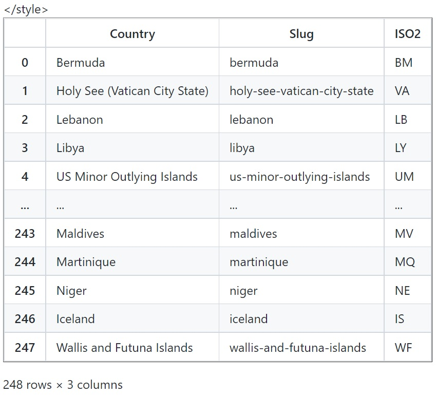
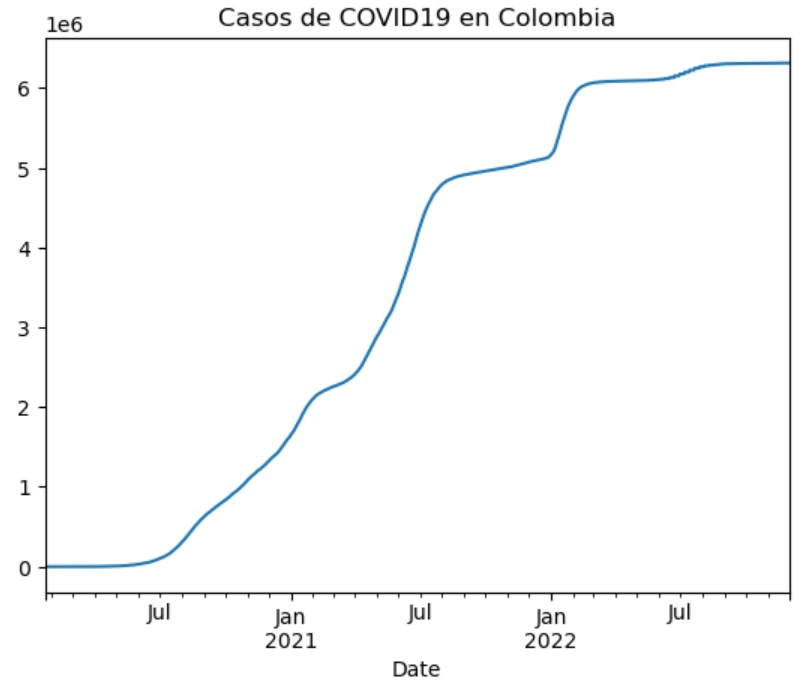

## Luisa Fernanda Restrepo Perdomo

## Periodismo de Datos II: Herramientas Digitales para la Visualización y Presentación de Datos

## Metodología 

En este documento realizado en jupyter llamado metodologia explicaré el procedimiento de los trabajos y las tareas realizadas para conseguir la web con la funcionalidad pages como si fuera un ejercicio de programación literaria, es decir, con bloques de texto y de código.

A lo largo del curso hicimos varios ejercicios en lenguaje markdown que nos permitieron aprender a leer codigo de python en la aplicación jupyter y usando algunas herramientas como el repositorio GitHub y la librería pandas. 

Acá detallaré el proceso de cada actividad para mostrar lo aprendido en la materia.

### Actividad 1 (ad1)

Esta actividad consistió en hacer un **comentario crítico sobre una pieza de periodismo de datos, visualización de datos o infografía.** Para hacer el anális usamos lo aprendido en Periodismo de Datos I. [La pieza analizada fue esta.](https://www.elcolombiano.com/multimedia/infografias/las-prioridades-para-contener-avance-del-covid-19-BF12609228)

Al principio esta actividad fue desafiante pues no conocía el lenguaje markdown y nunca había oido hablar de GitHub.

Usamos el editor de texto o "pad" que nos permitió escribir el texto de forma colaborativa. Este editor fue "riseup". Cada uno escribió su texto en lenguaje markdown, una lenguaje que se asemeja al "código fuente" de un texto y que se utiliza para componer páginas web, cuadernos de Python y para gráficos interactivos. También sirve para la transformación a cualquier formato estructurado como PDF, docx o HTML de los contenidos. 

El codigo de markdown nos permitió phacer:

Encabezados de diferente nivel con almohadillas #.

Negrita, utilizando 2 asteriscos **al principio y al final del texto**.

Enlaces, con el texto a enlazar entre corchetes y la url entre paréntesis.

Eso al principio, luego aprendimos sobre el repositoria GitHub, que es un portal usado para alojar el código de las aplicaciones de cualquier desarrollador. En este guardamos el contenido que elaboramos en lenguaje markdown. 

Cuando estuve más familiriazada pude añadir en el GitHub imágenes con atributos alt y links. La imágenes se pueden añadir como desde la url o subiendo directamente los archivos al repositorio.

En este caso añadí la infografía como una imagen desde la url poniendola entre paréntesis precedida por el atributo alt entre corchetes y el signo de admiración final.

La ad1 se puede [encontrar aquí.](https://github.com/nebrijas/2022online-luisafrp/blob/main/ad1.md)


**Cada uno desde su usuario en GitHub creo una pequeña página web compuesta por las carpetas de cada una de las actividades que desarrollamos durante el curso**, nombrándolas de la misma forma pues es importante cuidar la unidad en la escritura para facilitar su ejecución.

Estos contenidos están disponibles y se pueden visualizar online gracias a "pages". Esta aplicación te permite publicar el código del sitio en vivo en la web.

### Actividad 2 (ad2)

Esta actividad consistió en realizar un **comentario de un artículo o reportaje de periodismo y visualización de datos.** También fue escrito en markdown y subido al repositorio de Github.

En este caso fue, [este reportaje sobre los mundiales](https://www.eltiempo.com/datos/mundial-qatar-2022-datos-curiosos-de-la-copa-mundo-de-la-fifa-711095), que contiene un gráfico que me llamó mucho la atención por la forma como está hecho. Es el que se muestra en la imagen destacada del comentario.

En este ejercicio ya estaba más familiarizada con el markdown y el GitHub entonces pude aprender más cosas, como que se puede cargar una imagen como archivo al repositorio. En este ejercicio añadí la infografía que analicé, precedida por un atributo alt que explica el contenido de la imagenen, y el signo de admiración final al inicio del código.

El comentario estuvo relacionado a lo aprendido en las clases sobre la forma correcta de hacer visualizaciones y el uso de los datos en estas. Este ejercició también se subió al repositorio de GitHub. 

La ad2 se puede [encontrar aquí.](https://github.com/nebrijas/2022online-luisafrp/blob/main/ad2.md)

### Actividad 3 (ad3)

Acá transformamos un ejercicio de código de Python para lograr un scraping de una web. Esto significa sacar datos mediante algunas herramientas o librerías que leen el código. 

En este ejercicio profundizamos un poco más en las herramientas para el análisis y la visualización de datos. Lo primero que hicimos fue instalar Anaconda, un sofware de procesamientos de datos que tiene diferentes lenguajes de programación. Una vez se instalado, pudimos acceder desde allí a jupyter, una aplicación web que permite generar cuadernos de Python y Markdown. Y desde jupyter comenzamos a hacer un **ejercicio de programación literaria.**

El archivo que desglosamos fue un código de python (py) y comentamos el paso a paso. 

En este ejercicio aprendí que hay varias librerías que nos permiten leer código python. Entre ellas están: pandas, request, termcolor, BeautifulSoup, entre otras. Algunas de estas liberías son externas y otras vienen con la herramienta anaconda que anteriormente nos habíamos descargado a nuestro computador.

Me pareció un ejercicio muy util para sacar información muy específica por medio de etiquetas o "tags". La idea fue lograr un ejercicio en el que entendieramos lo que estábamos haciendo y luego, si lo veíamos después de un tiempo, pudieramos leer de igual forma. Es como un hilo argumental en un cuaderno de notas.

Lo más importante de la actividad fue descargar las librerías y ponerlas a correr para luego ejecutar las acciones en orden a obtener los datos.

El ejercicio se puede [encontrar aquí.](https://github.com/nebrijas/2022online-luisafrp/blob/main/ad3.md)

**Esta es la forma como se instalan las librerías y los nombres de estas:**


```python
!pip install requests bs4 pandas termcolor
```

    Requirement already satisfied: requests in c:\users\luisa\anaconda3\lib\site-packages (2.28.1)
    Requirement already satisfied: bs4 in c:\users\luisa\anaconda3\lib\site-packages (0.0.1)
    Requirement already satisfied: pandas in c:\users\luisa\anaconda3\lib\site-packages (1.4.4)
    Requirement already satisfied: termcolor in c:\users\luisa\anaconda3\lib\site-packages (2.1.1)
    Requirement already satisfied: certifi>=2017.4.17 in c:\users\luisa\anaconda3\lib\site-packages (from requests) (2022.9.14)
    Requirement already satisfied: urllib3<1.27,>=1.21.1 in c:\users\luisa\anaconda3\lib\site-packages (from requests) (1.26.11)
    Requirement already satisfied: idna<4,>=2.5 in c:\users\luisa\anaconda3\lib\site-packages (from requests) (3.3)
    Requirement already satisfied: charset-normalizer<3,>=2 in c:\users\luisa\anaconda3\lib\site-packages (from requests) (2.0.4)
    Requirement already satisfied: beautifulsoup4 in c:\users\luisa\anaconda3\lib\site-packages (from bs4) (4.11.1)
    Requirement already satisfied: numpy>=1.18.5 in c:\users\luisa\anaconda3\lib\site-packages (from pandas) (1.21.5)
    Requirement already satisfied: python-dateutil>=2.8.1 in c:\users\luisa\anaconda3\lib\site-packages (from pandas) (2.8.2)
    Requirement already satisfied: pytz>=2020.1 in c:\users\luisa\anaconda3\lib\site-packages (from pandas) (2022.1)
    Requirement already satisfied: six>=1.5 in c:\users\luisa\anaconda3\lib\site-packages (from python-dateutil>=2.8.1->pandas) (1.16.0)
    Requirement already satisfied: soupsieve>1.2 in c:\users\luisa\anaconda3\lib\site-packages (from beautifulsoup4->bs4) (2.3.1)
    

Cada librería tiene un uso particular:

**Librerías que vienen instaladas:**

**csv:** (valores separados por comas). Es el formato habitual de importación y exportación de hojas de cálculo y bases de datos.

**re:** esta nos ayuda para la coincidencia de expresiones regulares similares a las encontradas en Perl.

**os:** nos ayuda a usar funciones del sistema operativo.

**time:** tiene varias funciones relacionadas con el tiempo. 

**Librerías que hay que instalar:**

**requests:** se usa para hacer solicitudes y peticiones a la página de la que extraeremos datos.

**pandas:** es una herramienta de análisis de datos de código en el lenguaje de python.

**Termcolor:** sirve para imprimir mensajes de colores en el terminal.

**BeautifulSoup** sirve para obtener datos en formato HTML y XML.

Luego buscamos obtener los resultados. Para esto llamamos a la libería request que nos ayudó a **descargar los resultados de la página de El País en sus distintas secciones.** Y así sucesivamente llamamos a las otras liberías para extraer los datos que necesitabamos en este caso lo títulos h2. 

Con el código correcto se le puede ir dando valor a las distintas variables para que extraigan cualquier tipo de información como palabras, títulos, listas, números etc. Con Termcolor se pueden imprimir mensajes con color.

Al finalizar la actividad descargamos del jupyter dos archivos uno en formato jupyter y otro en formato markdown para subirlos  respectivamente al GiyHub y al campusvirtual de Nebrija.

### Actividad 4 (ad4)

La actividad consistió en **conectar desde Jupyter a la API de datos del COVID19** a la que se puede [acceder aquí](https://covid19api.com).

Fue la actividad a mi modo de ver más interesante porque pudimos elaborar gráficos con datos sobre la pandemia de varios paises como Colombia, Ecuador, República Dominicana y España. Además hicimos el recorrido literario de cada una de las acciones.

Aquí aprendí lo que es un dataframe, que es un marco de datos que sirve para encerrar, organizar e ilustrar nuestra información.
A este dataframe se puede explorar de muchas formas y nos brinda la información que queramos para poder comparar los datos y obtenerlos ordenados de forma que podamos hacer gráficos.



Asímismo aprendí a sobre la función j_son que sirve para leer código JavaScript.

Finalmente, para elaborar un gráfico, objetivo principal de esta actividad, seleccionamos los ejes, en este caso la fecha y el número de casos. Luego lo ilustramos con "plot" de plotear (df_co.set_index('Date')['Cases'].plot()) y por último lo nombramos añadiendo al final la función "title".



La ad4 se puede [ver aquí.](https://github.com/nebrijas/2022online-luisafrp/blob/main/ad4.md)


```python

```
